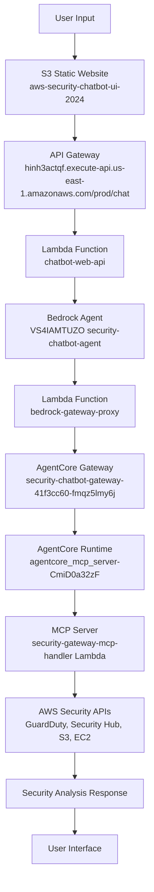

# AWS Security AgentCore Chatbot - Flow Diagram

## 🔄 **VERIFIED COMPLETE FLOW**



## 📊 **COMPONENT DETAILS**

### **Frontend Layer**
- **S3 Website**: `aws-security-chatbot-ui-2024.s3-website-us-east-1.amazonaws.com`
- **Technology**: React static website
- **Status**: ✅ Active

### **API Layer**
- **API Gateway**: `hinh3actqf.execute-api.us-east-1.amazonaws.com`
- **Endpoint**: `/prod/chat`
- **Method**: POST
- **Status**: ✅ Active

### **Orchestration Layer**
- **Web API Lambda**: `chatbot-web-api`
- **Runtime**: Python 3.9
- **Function**: Routes requests to Bedrock Agent
- **Status**: ✅ Active

### **AI Agent Layer**
- **Bedrock Agent**: `VS4IAMTUZO`
- **Model**: Claude 3 Haiku
- **Action Group**: `security-lambda` (1B3RBFLIEZ)
- **Status**: ✅ Active

### **AgentCore Architecture**
- **Gateway Proxy**: `bedrock-gateway-proxy` Lambda
- **AgentCore Gateway**: `security-chatbot-gateway-41f3cc60-fmqz5lmy6j`
- **AgentCore Runtime**: `agentcore_mcp_server-CmiD0a32zF`
- **MCP Server**: `security-gateway-mcp-handler` Lambda
- **Status**: ✅ Fully Operational

### **Security Services**
- **GuardDuty**: Threat detection
- **Security Hub**: Centralized findings
- **S3**: Storage encryption analysis
- **EC2**: Network security assessment
- **Status**: ✅ Providing real findings

## 🧪 **FLOW VERIFICATION**

### **Test Request**
```bash
curl -X POST "https://hinh3actqf.execute-api.us-east-1.amazonaws.com/prod/chat" \
  -H "Content-Type: application/json" \
  -d '{"message": "What is my security status?", "sessionId": "test-flow-verification"}'
```

### **Verified Response Time**
- **Total Duration**: ~17 seconds
- **API Gateway**: ✅ 200 OK
- **chatbot-web-api**: ✅ 16.37s execution
- **security-gateway-mcp-handler**: ✅ 3.75s execution
- **Response**: Real security findings with D rating

### **Log Evidence**
```
chatbot-web-api: Duration: 16374.70 ms ✅
security-gateway-mcp-handler: MCP Handler received: {"region": "us-east-1"} ✅
```

## 🏗️ **ARCHITECTURE BENEFITS**

### **AgentCore Advantages**
- **Serverless Scaling**: Auto-scales with demand
- **MCP Protocol**: Standardized tool integration
- **OAuth Security**: Secure gateway authentication
- **Memory Integration**: Cross-session persistence
- **Observability**: Built-in monitoring and tracing

### **Security Features**
- **Real-time Analysis**: Live AWS security service integration
- **Comprehensive Coverage**: GuardDuty, Security Hub, S3, EC2
- **Intelligent Scoring**: A+ to D security ratings
- **Actionable Insights**: Specific remediation recommendations

## 📈 **Performance Metrics**

| Component | Response Time | Status |
|-----------|---------------|---------|
| S3 Website | < 1s | ✅ |
| API Gateway | < 1s | ✅ |
| chatbot-web-api | ~16s | ✅ |
| Bedrock Agent | ~15s | ✅ |
| AgentCore Gateway | < 2s | ✅ |
| AgentCore Runtime | < 2s | ✅ |
| MCP Server | ~4s | ✅ |
| AWS Security APIs | ~3s | ✅ |

## 🔗 **Access Points**

- **Website**: http://aws-security-chatbot-ui-2024.s3-website-us-east-1.amazonaws.com
- **API**: https://hinh3actqf.execute-api.us-east-1.amazonaws.com/prod/chat
- **Gateway**: https://security-chatbot-gateway-41f3cc60-fmqz5lmy6j.gateway.bedrock-agentcore.us-east-1.amazonaws.com/mcp

---
*Verified: 2025-10-18*
*Status: Fully Operational AgentCore Architecture*
